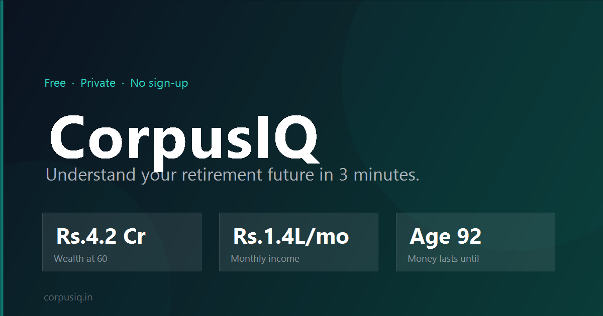

# CorpusIQ

Understand your retirement future in 3 minutes. Turn your NPS, PF, and mutual fund numbers into a plain-language story - free, private, no sign-up.

**Live:** https://corpusiq.netlify.app



## What it does

- Takes your current age, retirement age, and investment balances (NPS / PF / Mutual Funds)
- Projects your corpus, monthly retirement income, and how long the money lasts
- Shows milestones, health score, peer comparison, FIRE check, and what-if scenarios
- Everything runs in the browser and nothing is sent to a server

## Stack

- React.js + Vite
- Tailwind CSS
- Framer Motion
- All calculations in `src/utils/calculations.js`

## Local setup

1.  Clone the repository:

    ```bash
    git clone https://github.com/yodkwtf/corpusiq
    ```

2.  Navigate to the project directory:

    ```bash
    cd corpusiq
    ```

3.  Install the dependencies:

    ```bash
    npm install
    ```

4.  Start the development servers:

    ```bash
    npm run dev
    ```

5.  Open the browser and navigate to `http://localhost:5173/` to view the application.

## Contributing

Contributions are welcome! Please fork the repository and submit a pull request for any updates.

A few things to know:

- All financial logic is in `src/utils/calculations.js` - that's the most critical file to get right
- `src/context/plannerState.js` holds the default state shape and validation
- Components are in `src/components/`, pages in `src/pages/`
- No backend, no auth, no tracking, please keep it that way

## Contact

- **Email:** [48durgesh.chaudhary@gmail.com](mailto:48durgesh.chaudhary@gmail.com)
- **LinkedIn:** [Durgesh Chaudhary](https://www.linkedin.com/in/durgesh-chaudhary/)
- **GitHub:** [@yodkwtf](https://github.com/yodkwtf)
